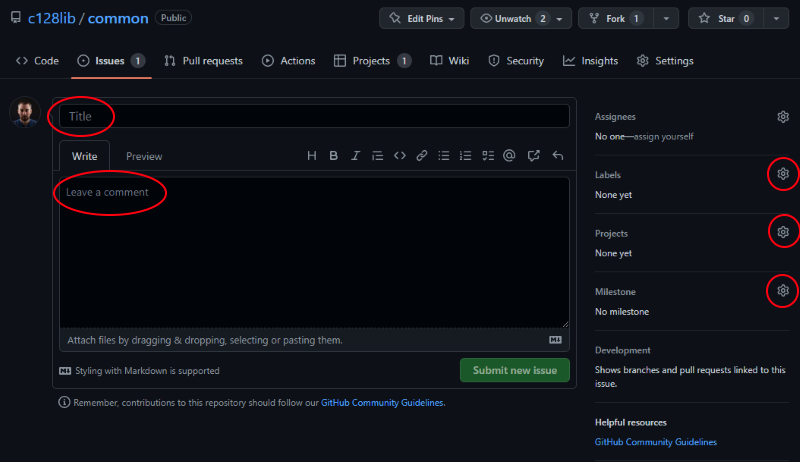
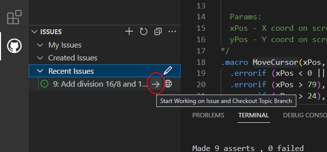
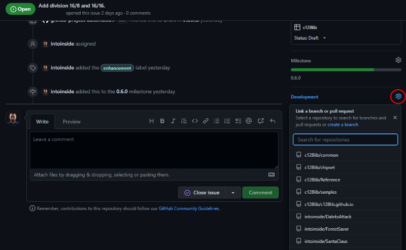

# Best practice

## Create an issue
Every feature or bug should have an issue in repository.
Issues should be populated with:
* consistent title
* label (at least enhancement, bug or documentation)
* project (should be c128lib)

Nice to have:
* description of the feature
* milestone

Prioritizing and assignment should be negotiated with other member of team.

## Develop an issue
An issue should be developed in its own branch.

It's better to use VsCode extension. You can check and install by using this documentation: https://code.visualstudio.com/docs/sourcecontrol/github

After this, you can navigate through issue (assigned to you or assigned to project you own or collaborate). 
You need to choose you issue and click on the checkbox like the image.

This operation will create and checkout a new branch.
When you push your commits (even if you have not completed your issue), you can edit issue by adding branch name on it.
So your commit will be automatically linked to your issue.

## Create a pull request
